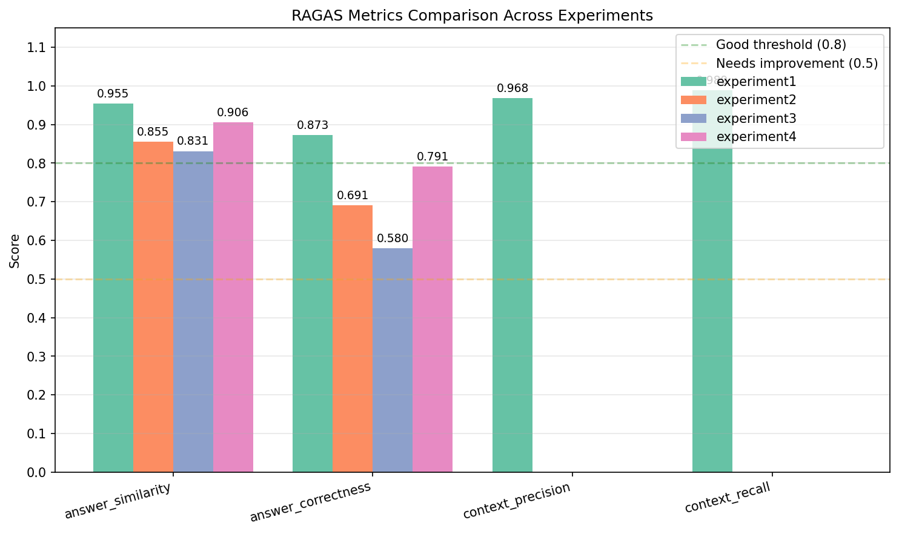
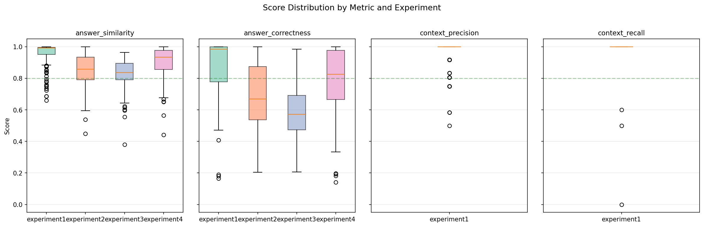
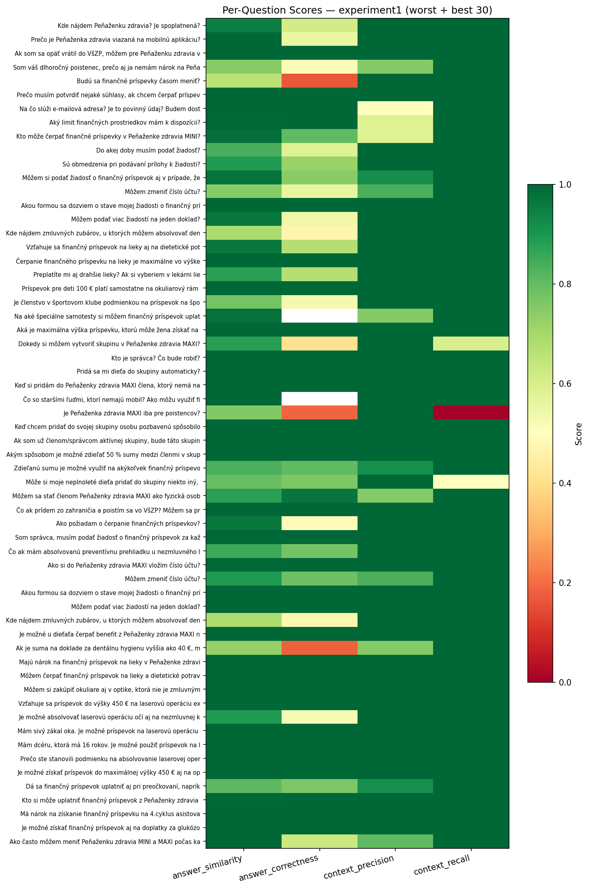
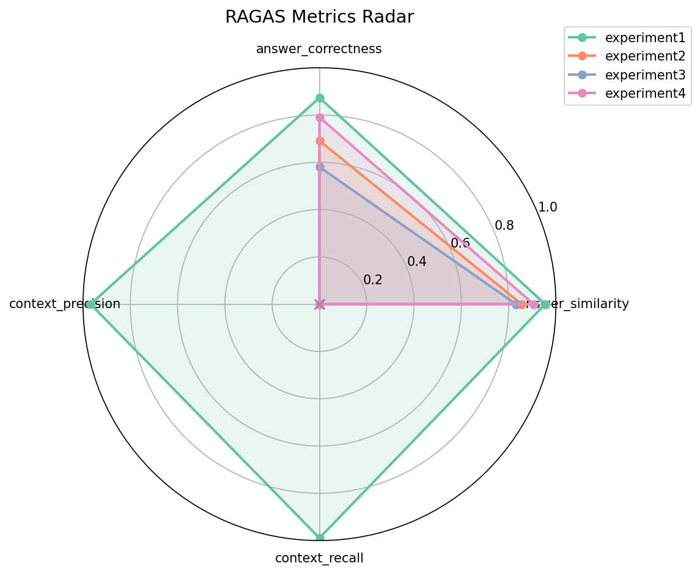

# RAGAS Evaluation POC: Comparing LLM Quality in RAG Systems

A proof-of-concept that evaluates how different LLMs perform as the generation backbone of a Retrieval-Augmented Generation (RAG) system. Four models are tested against 182 Slovak health insurance FAQ pairs using [RAGAS](https://github.com/explodinggradients/ragas) metrics, with a consistent judge model (Gemma 3 27B) scoring all experiments.

## Architecture

```
OpenShift AI Cluster (RHOAI 3.3+)
┌─────────────────────────────────────────────────────────────────────────────┐
│                                                                             │
│  model namespace (vszp)           llama-stack-rag namespace                 │
│  ┌───────────────────────┐        ┌──────────────────────────────┐          │
│  │ vLLM InferenceService │◄───────│ Llama Stack RAG              │          │
│  │  (experiment model)   │        │  - vector store (PGVector)   │          │
│  │                       │        │  - retrieval + generation    │          │
│  │ vLLM InferenceService │        └──────────────────────────────┘          │
│  │  (qwen3-4b-embedding) │                                                  │
│  │                       │        ragas-eval namespace                       │
│  │ vLLM InferenceService │        ┌──────────────────────────────┐          │
│  │  (gemma-3-27b judge)  │◄───────│ Llama Stack + RAGAS inline   │          │
│  └───────────────────────┘        │  - ragas evaluation engine   │          │
│                                   │  - Jupyter workbench         │          │
│                                   └──────────────────────────────┘          │
│                                                                             │
└─────────────────────────────────────────────────────────────────────────────┘
```

**How it works:**

1. Each experiment deploys a different LLM as the RAG generation model in the `vszp` namespace
2. The **llama-stack-rag** instance (deployed via the [rh-ai-quickstart/RAG](https://github.com/rh-ai-quickstart/RAG) project) retrieves context from a PGVector vector store and generates answers using the experiment model
3. The **ragas-eval** instance (deployed using manifests in [`deployment/ragas-eval/`](deployment/ragas-eval/)) runs RAGAS evaluation with a separate, consistent judge model (Gemma 3 27B)
4. vLLM model serving is managed via KServe InferenceServices — see [`deployment/`](deployment/) for deployment scripts and model configs
5. The [llama-stack-provider-ragas](https://github.com/trustyai-explainability/llama-stack-provider-ragas) provider bridges RAGAS metrics into the Llama Stack eval API

## RAGAS Metrics Explained

This project evaluates RAG quality using four RAGAS metrics. Each metric uses the judge LLM to score different aspects of the RAG pipeline:

### Answer Metrics (evaluated for all 4 experiments)

| Metric | What it measures | How RAGAS computes it |
|--------|-----------------|----------------------|
| **answer_similarity** | Semantic similarity between the RAG response and the ground truth reference answer | Uses the embedding model to generate vector representations of both the RAG response and the reference answer, then computes cosine similarity between them. Score range: 0-1. |
| **answer_correctness** | Factual correctness of the RAG response compared to the reference answer | Combines two components: (1) an F1 score from statement-level overlap between the response and reference (the judge LLM extracts factual statements from both, then classifies them as TP/FP/FN), and (2) semantic similarity. The default weighting is 0.75 * F1 + 0.25 * similarity. Score range: 0-1. |

### Context Metrics (evaluated for experiment 1 only)

| Metric | What it measures | How RAGAS computes it |
|--------|-----------------|----------------------|
| **context_precision** | Whether the retrieved contexts are relevant to the question | The judge LLM evaluates each retrieved context chunk against the question and reference answer, determining if the context is useful for answering the question. Computed as a weighted precision where higher-ranked relevant contexts score higher (mean average precision). Score range: 0-1. |
| **context_recall** | Whether the retrieved contexts cover all information needed to answer the question | The judge LLM breaks the reference answer into individual statements, then checks whether each statement can be attributed to one of the retrieved context chunks. Score = (attributed statements) / (total statements). Score range: 0-1. |

## Experiment Results

All experiments use 182 Slovak health insurance FAQ pairs as ground truth. The judge model is **Gemma-3-27B-BF16** (consistent across all experiments). The embedding model is **Qwen3-4B-Embedding** (2048 dimensions).

| Experiment | RAG Generation Model | Type | answer_similarity | answer_correctness | context_precision | context_recall |
|------------|---------------------|------|:-----------------:|:------------------:|:-----------------:|:--------------:|
| 1 (Baseline) | Gemma 3 27B BF16 | Instruct | **0.9547** | **0.8733** | **0.9683** | **0.9893** |
| 4 | Gemma 4 31B IT | Instruct | 0.9059 | 0.7908 | - | - |
| 2 | EuroLLM-22B | Instruct | 0.8555 | 0.6911 | - | - |
| 3 | Qwen3-32B | **Base** | 0.8312 | 0.5800 | - | - |

## Analysis

### Overall Model Ranking



The bar chart compares aggregated scores across all experiments with threshold lines at 0.8 (good) and 0.5 (needs improvement). **Experiment 1 (Gemma 3 27B)** is the clear winner — it is the only model that exceeds the 0.8 "good" threshold on both answer metrics. Gemma 4 31B (experiment 4) comes second with answer_correctness at 0.791, just below the threshold. EuroLLM-22B and Qwen3-32B both fall significantly short on answer_correctness (0.691 and 0.580 respectively).

### Score Distribution



The box plots reveal the consistency of each model's performance across all 182 questions:

- **Experiment 1 (Gemma 3 27B)** has the tightest distribution — both the interquartile range and whiskers are compact, indicating reliable performance across questions. The median sits near the top of the range.
- **Experiment 4 (Gemma 4 31B)** shows a wider spread in answer_correctness despite a good median, suggesting inconsistent quality on harder questions.
- **Experiment 3 (Qwen3-32B base)** has the widest spread and lowest median, with the box extending well below the 0.8 threshold. This is expected for a base (non-instruct) model that hasn't been fine-tuned for instruction following.
- **Context metrics** (experiment 1 only): context_precision shows most questions scoring 1.0 with a few outliers, while context_recall is similarly concentrated at 1.0 with rare drops. This confirms the retrieval pipeline is strong.

### Per-Question Heatmap



The heatmap shows per-question performance for experiment 1 (worst 30 + best 30 questions) across all four metrics. Most questions are dark green (high scores), with a handful of problematic questions visible as lighter/red cells. The questions that score poorly on answer_correctness tend to also score lower on context_recall, suggesting that for those questions the vector store doesn't contain sufficient information — a retrieval gap rather than a generation problem.

### Multi-Metric Radar



The radar chart provides a multi-dimensional view. Experiment 1's polygon (green) covers nearly the entire chart area across all 4 axes. Experiments 2-4 only have data on the two answer-metric axes (the right side), so their polygons are triangular. This visualization highlights how comprehensively experiment 1 was evaluated compared to the others.

### Why Context Metrics Were Only Computed for Experiment 1

Context metrics (`context_precision` and `context_recall`) were only run for experiment 1 because:

1. **Context is constant across experiments.** All four experiments use the same retrieval pipeline (same embedding model, same vector store, same documents). The retrieved contexts for a given question are identical regardless of which generation model is used — only the generated answer differs. Running context metrics for all experiments would produce nearly identical scores.
2. **Cost.** Each context metric evaluation takes 10-25 minutes for 182 questions using the judge LLM. Since the retrieval quality was confirmed as excellent (precision=0.968, recall=0.989) in experiment 1, repeating this for experiments 2-4 would consume GPU time without producing new insights.

### Key Observations

- **Instruct vs Base model matters significantly.** Experiment 3 (Qwen3-32B base) scored 0.29 points lower on answer_correctness than experiment 1 (Gemma 3 27B instruct), despite being a larger model. Base models generate less structured, less instruction-following responses that RAGAS judges more harshly.
- **The retrieval pipeline is not the bottleneck.** With context_precision=0.968 and context_recall=0.989, the PGVector + Qwen3-4B-Embedding retrieval pipeline consistently surfaces the right information. Quality differences across experiments are driven entirely by the generation model.
- **Slovak language capability varies.** This dataset is in Slovak — EuroLLM-22B was designed for European languages but still underperformed Gemma 3, suggesting that multilingual strength alone doesn't guarantee RAG quality.
- **Same model as judge and generator inflates scores.** Experiment 1 uses Gemma 3 27B for both RAG generation and RAGAS evaluation (as the judge model). This may partially inflate its scores due to stylistic alignment — the judge model naturally favors responses written in its own style. For a fully unbiased comparison, a different judge model would be needed.

### Suggested Next Steps

1. **Re-run experiment 3 with Qwen3-32B-Instruct** to isolate the impact of instruction tuning vs model architecture
2. **Use a different judge model** (e.g., GPT-4o or Claude) to eliminate potential bias from using Gemma 3 as both generator and judge in experiment 1
3. **Add faithfulness metric** — currently blocked by Gemma 3's output format not matching RAGAS's expected structured format (see `deployment/ragas-eval/README.md` troubleshooting)
4. **Test with more languages** — the current dataset is Slovak-only; testing with English/multilingual FAQs would reveal whether the model ranking holds across languages
5. **Experiment with different embedding models** — the current Qwen3-4B-Embedding performs well, but comparing with larger embedding models could reveal whether the ~2% retrieval gap can be closed

## Prerequisites

To reproduce this on your own cluster:

**Compute:**
- **OpenShift AI** (RHOAI 3.3+) with GPU worker nodes
- **Inference models:** 4x NVIDIA A10G (or equivalent, ~90 GB total VRAM) per generation model deployed with `--tensor-parallel-size=4` in BF16
- **Embedding model:** 1x NVIDIA A10G (or equivalent GPU with at least 8 GB VRAM) — the Qwen3-4B-Embedding model requires 1 GPU, ~4 GB VRAM

**Software:**
- **KServe** for vLLM model serving (InferenceService CRDs)
- **Llama Stack Operator** (activated via DataScienceCluster CR)
- **RAG system** deployed in `llama-stack-rag` namespace with vector store populated — see [rh-ai-quickstart/RAG](https://github.com/rh-ai-quickstart/RAG)
- **RAGAS inline provider** deployed in `ragas-eval` namespace — see [`deployment/ragas-eval/`](deployment/ragas-eval/)
- **MinIO** for S3 model storage and eval data
- **PGVector** for vector store and Llama Stack metadata

## Reproduction Guide

### 1. Deploy Infrastructure

1. **RAG system**: Follow [rh-ai-quickstart/RAG](https://github.com/rh-ai-quickstart/RAG) to deploy the llama-stack-rag instance, MinIO, and PGVector
2. **RAGAS evaluation environment**: Follow [`deployment/ragas-eval/README.md`](deployment/ragas-eval/README.md) to deploy the RAGAS inline provider on Llama Stack

### 2. Deploy Models

Use the deployment scripts and model configs:

```bash
cd deployment

# Deploy the judge model (used for RAGAS evaluation)
bash deploy-model.sh model-configs/values-gemma-3-27b-distributed.env

# Deploy the embedding model (shared across all experiments)
bash deploy-model.sh model-configs/values-qwen3-4b-embedding.env

# Deploy an experiment model
bash deploy-model.sh model-configs/values-gemma-4-31b.env
```

See [`deployment/README.md`](deployment/README.md) for the full model deployment and switching guide.

### 3. Prepare Test Data

Run `prepare_qa_pairs.ipynb` to extract 182 Q&A pairs from the Slovak health insurance FAQ PDF. The output `qa_pairs.json` is already included in this repo.

### 4. Run an Experiment

For each experiment model:

1. **Deploy the model** and update both Llama Stack instances to point to it (see [`deployment/README.md` — Switching Models](deployment/README.md#switching-models))
2. **Run smoke test**: `experiment*/smoke_test.ipynb` — verifies connectivity and basic inference
3. **Query the RAG system**: `experiment*/query_rag_system.ipynb` — sends all 182 questions through the RAG pipeline, saves results to `eval_data_health_wallet.json`
4. **Run RAGAS evaluation**: `experiment*/ragas_eval_answer_metrics.ipynb` — registers the eval dataset, creates a benchmark, runs the evaluation job, and saves results to `results/`

For a detailed walkthrough of the experiment workflow, see [`deployment/experiment-guide.md`](deployment/experiment-guide.md).

### 5. Compare Results

Run `ragas_results_comparison.ipynb` to generate cross-experiment comparison charts.

## Project Structure

```
proj-poc-RAGAS/
├── README.md                                # This file
├── .gitignore
├── prepare_qa_pairs.ipynb                   # Extract Q&A pairs from FAQ PDF
├── qa_pairs.json                            # 182 Slovak health insurance FAQ pairs
├── ragas_results_comparison.ipynb           # Cross-experiment analysis + charts
├── comparison_*.png                         # Visualization outputs (4 images)
│
├── experiment1-Gemma-3-27B-bf16-distributed/  # Baseline (best performer)
│   ├── smoke_test.ipynb                     # Connectivity + inference check
│   ├── query_rag_system.ipynb               # Query RAG -> generate responses
│   ├── eval_data_health_wallet.json         # RAG outputs (checkpoint)
│   ├── ragas_eval_answer_metrics.ipynb      # RAGAS eval: similarity + correctness
│   ├── ragas_eval_context_metrics.ipynb     # RAGAS eval: precision + recall
│   └── results/                             # JSON result files
│
├── experiment2-EuroLLM-22B/                 # EuroLLM-22B-Instruct
├── experiment3-Qwen3-32B/                   # Qwen3-32B (base model, not instruct)
├── experiment4-Gemma-4-31B/                 # Gemma-4-31B-IT
│   └── (same structure as experiment1, without context metrics)
│
├── deployment/                              # Infrastructure & deployment docs
│   ├── README.md                            # Model deployment, switching, and lessons learned
│   ├── deploy-model.sh                      # Main deployment script
│   ├── experiment-guide.md                  # End-to-end experiment workflow guide
│   ├── model-configs/                       # One .env per model
│   ├── templates/                           # K8s manifest templates
│   ├── runtimes/                            # vLLM ServingRuntime manifests
│   └── ragas-eval/                          # RAGAS eval deployment (CR, patches, guide)
│
└── tests/
    └── sheryl_test_inline_ragas.ipynb        # RAGAS provider connectivity test
```